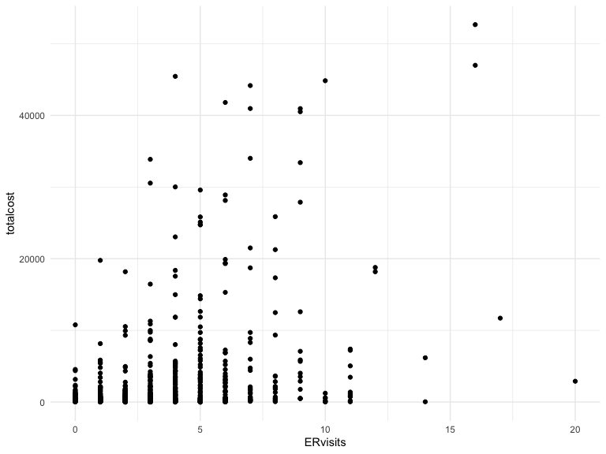
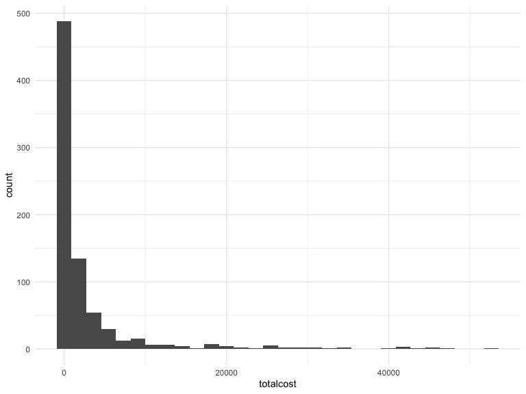
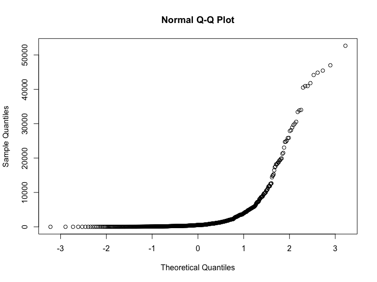
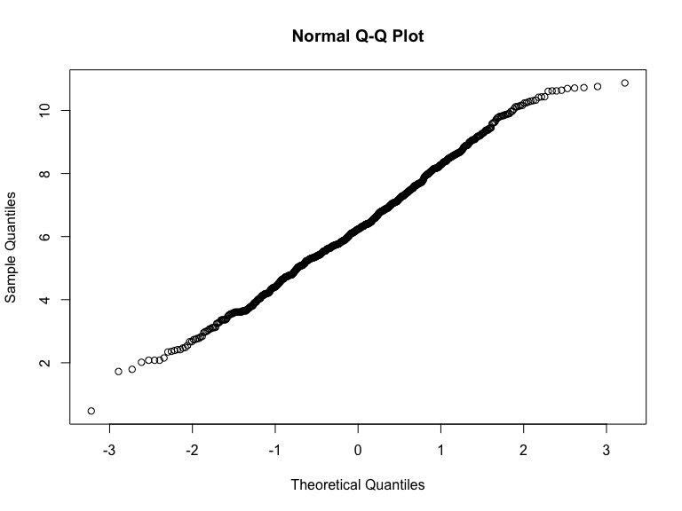
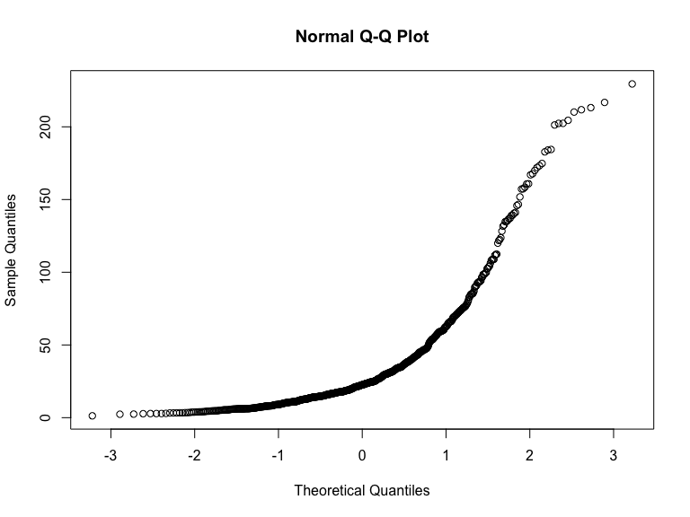
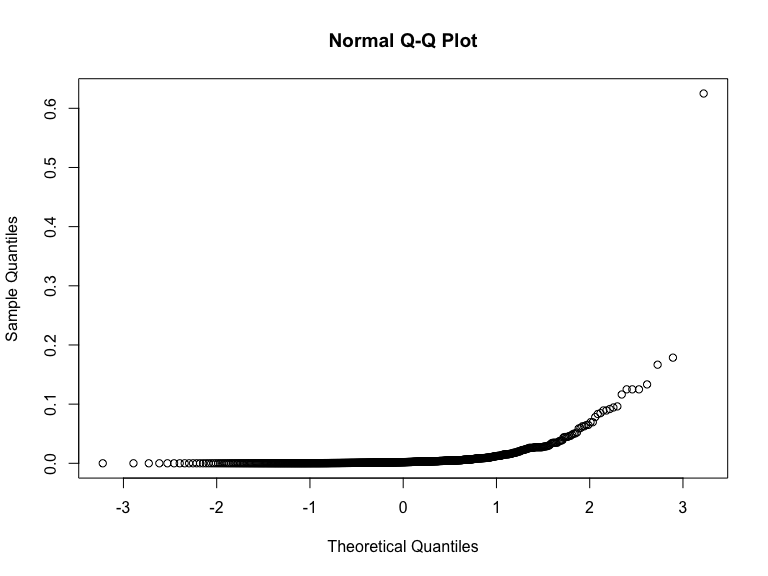
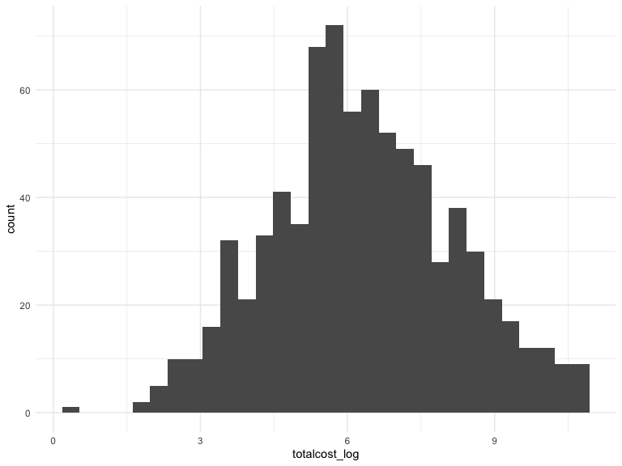
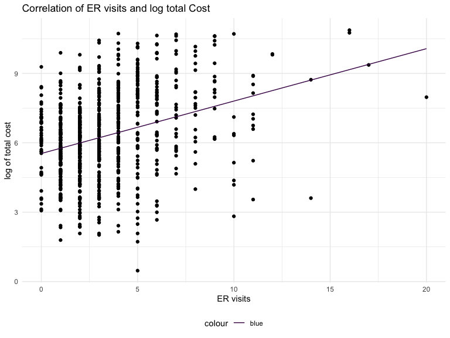

p8130_hw4_brm2150
================
Brooklynn McNeil
2024-11-17

Brooklynn McNeil’s homwork assignment 4 for p8130 Biostatistical Methods
1.

## Problem 1

A new device for evaluating blood sugar levels is being tested.

1.  Below is the sign test for the blood sugar readings. The null
    hypothesis is that the median is equal to 120. The alternative
    hypothesis is one-sided that the blood sugar median is less
    than 120. Since the p-value is greater than 0.05 we fail to reject
    the null and conclude that the median is less than 120.

``` r
sugar_test = c(125,123,117,123,115,112,128,118,124,111,116,109,125,120,113,123,112,118,121,118,122,115,105,118,131)

SIGN.test(sugar_test, md = 120, alternative = "less", conf.level = 0.95) 
```


        One-sample Sign-Test

    data:  sugar_test
    s = 10, p-value = 0.2706
    alternative hypothesis: true median is less than 120
    95 percent confidence interval:
         -Inf 122.1203
    sample estimates:
    median of x 
            118 

    Achieved and Interpolated Confidence Intervals: 

                      Conf.Level L.E.pt   U.E.pt
    Lower Achieved CI     0.9461   -Inf 122.0000
    Interpolated CI       0.9500   -Inf 122.1203
    Upper Achieved CI     0.9784   -Inf 123.0000

2.  Let’s do the wilcoxon sign test with the same dataset.The p value
    from this test is also greater than 0.05, so we fail to reject the
    null again.

``` r
wilcox.test(sugar_test, alternative = "less", mu = 120, conf.int = 0.95)
```

    Warning in wilcox.test.default(sugar_test, alternative = "less", mu = 120, :
    cannot compute exact p-value with ties

    Warning in wilcox.test.default(sugar_test, alternative = "less", mu = 120, :
    cannot compute exact confidence interval with ties

    Warning in wilcox.test.default(sugar_test, alternative = "less", mu = 120, :
    cannot compute exact p-value with zeroes

    Warning in wilcox.test.default(sugar_test, alternative = "less", mu = 120, :
    cannot compute exact confidence interval with zeroes


        Wilcoxon signed rank test with continuity correction

    data:  sugar_test
    V = 112.5, p-value = 0.1447
    alternative hypothesis: true location is less than 120
    95 percent confidence interval:
      -Inf 120.5
    sample estimates:
    (pseudo)median 
          118.4334 

## Problem 2

1.  Fit a regression model for the nonhuman primate brain mass with
    `ln_brain_mass` as a predictor for `glia_neuron_ratio`.

``` r
brain_df = readxl::read_xlsx("data/Brain.xlsx") |>
  janitor::clean_names()

nonhuman_lm = brain_df |>
  filter(species != "Homo sapiens") |>
  lm(glia_neuron_ratio ~ ln_brain_mass, data = _)

broom::tidy(nonhuman_lm)
```

    # A tibble: 2 × 5
      term          estimate std.error statistic  p.value
      <chr>            <dbl>     <dbl>     <dbl>    <dbl>
    1 (Intercept)      0.164    0.160       1.02 0.322   
    2 ln_brain_mass    0.181    0.0360      5.03 0.000151

2.  Using the model from above, the predicted value for humans is
    calculated below.

``` r
human_brain_mass = brain_df |>
  filter(species == "Homo sapiens") |>
  select(ln_brain_mass)

predict.lm(nonhuman_lm, newdata = human_brain_mass)
```

           1 
    1.471458 

3.  Construct a prediction interval. This prediction is most appropriate
    for the prediction of human brain `glia_neuron_ratio` because we can
    compare the human brain mass to the trend of nonhuman primates,
    rather than treating it as a new individual.

``` r
predict.lm(nonhuman_lm, newdata = human_brain_mass, interval = "prediction")
```

           fit      lwr      upr
    1 1.471458 1.036047 1.906869

4.  Construct a 95% confidence interval. The actual value for human
    brain `glia_neuron_ratio` falls into the 95% confidence interval
    range from the nonhuman primate linear regression model. The results
    suggest that humans do not have an excessive `glia_neuron_ratio`
    compared to non-human primates.

``` r
predict.lm(nonhuman_lm, newdata = human_brain_mass, interval = "confidence", level = 0.95)
```

           fit      lwr      upr
    1 1.471458 1.229558 1.713358

``` r
brain_df |>
  filter( species == "Homo sapiens") |>
  pull(glia_neuron_ratio)
```

    [1] 1.65

5.  Considering that the value for human `ln_brain_mass` is the max for
    all values we have, we need to heed caution from our model because
    it was not trained on values that extreme.

## Problem 3

1.  Let's take a look at the heart disease data. There are 788 observations of 9 variables. The main predictor is `ERvisits` and the main outcome it `totalcost`. Other important covariates include, `age`, `gender`, `interventions`, `drugs`, `complications`, `comorbidities`, and `duration` of stay.

``` r
heart_df = read_csv("data/HeartDisease.csv")
```

    Rows: 788 Columns: 10
    ── Column specification ────────────────────────────────────────────────────────
    Delimiter: ","
    dbl (10): id, totalcost, age, gender, interventions, drugs, ERvisits, compli...

    ℹ Use `spec()` to retrieve the full column specification for this data.
    ℹ Specify the column types or set `show_col_types = FALSE` to quiet this message.

``` r
head(heart_df)
```

    # A tibble: 6 × 10
         id totalcost   age gender interventions drugs ERvisits complications
      <dbl>     <dbl> <dbl>  <dbl>         <dbl> <dbl>    <dbl>         <dbl>
    1     1      179.    63      0             2     1        4             0
    2     2      319     59      0             2     0        6             0
    3     3     9311.    62      0            17     0        2             0
    4     4      281.    60      1             9     0        7             0
    5     5    18727.    55      0             5     2        7             0
    6     6      453.    66      0             1     0        3             0
    # ℹ 2 more variables: comorbidities <dbl>, duration <dbl>

``` r
summary(heart_df$ERvisits)
```

       Min. 1st Qu.  Median    Mean 3rd Qu.    Max. 
      0.000   2.000   3.000   3.425   5.000  20.000 

``` r
summary(heart_df$totalcost)
```

       Min. 1st Qu.  Median    Mean 3rd Qu.    Max. 
        0.0   161.1   507.2  2800.0  1905.5 52664.9 

``` r
summary(heart_df$age)
```

       Min. 1st Qu.  Median    Mean 3rd Qu.    Max. 
      24.00   55.00   60.00   58.72   64.00   70.00 

``` r
summary(heart_df$interventions)
```

       Min. 1st Qu.  Median    Mean 3rd Qu.    Max. 
      0.000   1.000   3.000   4.707   6.000  47.000 

``` r
summary(heart_df$drugs)
```

       Min. 1st Qu.  Median    Mean 3rd Qu.    Max. 
     0.0000  0.0000  0.0000  0.4467  0.0000  9.0000 

``` r
summary(heart_df$gender)
```

       Min. 1st Qu.  Median    Mean 3rd Qu.    Max. 
     0.0000  0.0000  0.0000  0.2284  0.0000  1.0000 

``` r
heart_df |>
  ggplot(aes(x = ERvisits, y = totalcost, group = age)) +
  geom_point()
```



2.  Investigate the distribution of total cost. With a histogram we can
    see that the data is very rightly skewed. The `qqnorm` plot without
    transformation also proves that the data is not normally distributed
    as is. Performing a log transformation give the data a more normal
    distribution.

``` r
### with historgram

heart_df |>
  ggplot(aes(x = totalcost)) +
  geom_histogram()
```

    `stat_bin()` using `bins = 30`. Pick better value with `binwidth`.



``` r
### with qq plot
# no transformation
heart_df |>
  filter(totalcost > 0) |>                # Filter out zero or negative values
  pull(totalcost) |>
  qqnorm()
```



``` r
# log transformation
heart_log = heart_df |>
  filter(totalcost > 0) |>               
  mutate(totalcost_log = log(totalcost)) 

qqnorm(heart_log$totalcost_log) 
```



``` r
# square root transformation
heart_sqrt = heart_df |>
  filter(totalcost > 0) |>               
  mutate(totalcost_sqrt = sqrt(totalcost)) |>
  pull(totalcost_sqrt)
  
qqnorm(heart_sqrt)
```



``` r
# inverse transformation
heart_inverse = heart_df |>
  filter(totalcost > 0) |>
  mutate(totalcost_inverse = 1/totalcost) 

qqnorm(heart_inverse$totalcost_inverse)
```



``` r
## test the log transformation with histogram

heart_log|>
  ggplot(aes(x = totalcost_log)) +
  geom_histogram()
```

    `stat_bin()` using `bins = 30`. Pick better value with `binwidth`.



3.  Create a `comp_bin` variable for if there were no complications `0`
    or 1 or more `1`.

``` r
heart_log =
  heart_log |>
  mutate(comp_bin = case_when(
    complications == 0 ~ 0,
    complications != 0 ~ 1
  ))
```

4.  Create a linear regression model for the predictor of ER visits and
    the outcome of log transformed total cost. The model has a p-value
    of 3.49e-20, which gives plenty of evidence for rejecting the null
    hypothesis that ER visits has no correlation with the log total
    cost. The estimate for ER visits suggest that for each ER visit the
    log total cost will increase by 0.227.

``` r
# linear regression model
totalcost_lm = 
  lm(totalcost_log ~ ERvisits, data = heart_log)
broom::tidy(totalcost_lm)
```

    # A tibble: 2 × 5
      term        estimate std.error statistic   p.value
      <chr>          <dbl>     <dbl>     <dbl>     <dbl>
    1 (Intercept)    5.54     0.104      53.4  1.89e-263
    2 ERvisits       0.227    0.0240      9.46 3.49e- 20

``` r
# plot the model

heart_log |>
  gather_predictions(totalcost_lm)|>
  ggplot(aes(x = ERvisits, y = totalcost_log)) +
  geom_point() +
  geom_line(aes(y = pred, color = "blue")) +
  labs(title = "Correlation of ER visits and log total Cost",
       y = "log of total cost",
       x = "ER visits")
```



5.  Let’s fit a multiple linear regression model with `ERvisist` and
    `comp_bin` as predictors for `totalcost_log`.

``` r
# test if `comp_bin` is an effect modifier
model1 = 
  lm(totalcost_log ~ ERvisits * comp_bin, data = heart_log)
broom::tidy(model1)
```

    # A tibble: 4 × 5
      term              estimate std.error statistic   p.value
      <chr>                <dbl>     <dbl>     <dbl>     <dbl>
    1 (Intercept)         5.50      0.103      53.1  1.36e-261
    2 ERvisits            0.211     0.0245      8.61 3.99e- 17
    3 comp_bin            2.18      0.546       3.99 7.17e-  5
    4 ERvisits:comp_bin  -0.0993    0.0948     -1.05 2.96e-  1

The p-value of the interaction term is greater than 0.05 so we can
conclude that `comp_bin` is not an effect modifier. Since the p value
comparing the model with and without `comp_bin` is less than 0.05 we can
conclude that `comp_bin` is a confounding variable. We should keep it in
the further analysis since it has an effect on the total cost.

``` r
# test if `comp_bin` is a confounding variable
model_noComp = 
  lm(totalcost_log ~ ERvisits, data = heart_log)
broom::tidy(model_noComp)
```

    # A tibble: 2 × 5
      term        estimate std.error statistic   p.value
      <chr>          <dbl>     <dbl>     <dbl>     <dbl>
    1 (Intercept)    5.54     0.104      53.4  1.89e-263
    2 ERvisits       0.227    0.0240      9.46 3.49e- 20

``` r
model_withComp = 
  lm(totalcost_log ~ ERvisits + comp_bin, data = heart_log)
broom::tidy(model_withComp)
```

    # A tibble: 3 × 5
      term        estimate std.error statistic   p.value
      <chr>          <dbl>     <dbl>     <dbl>     <dbl>
    1 (Intercept)    5.52     0.101      54.5  1.68e-268
    2 ERvisits       0.205    0.0237      8.63 3.33e- 17
    3 comp_bin       1.69     0.275       6.13 1.38e-  9

``` r
broom::tidy(anova(model_noComp, model_withComp))$p.value
```

    [1]           NA 1.378861e-09

6.  Fit MLRs for other variables `age`, `gender`, and `duration`.

``` r
mlr_model = 
  lm(totalcost_log ~ ERvisits + comp_bin + age + gender + duration, data = heart_log)

broom::tidy(mlr_model)
```

    # A tibble: 6 × 5
      term        estimate std.error statistic  p.value
      <chr>          <dbl>     <dbl>     <dbl>    <dbl>
    1 (Intercept)  6.04     0.506       11.9   2.73e-30
    2 ERvisits     0.176    0.0223       7.87  1.15e-14
    3 comp_bin     1.49     0.255        5.84  7.65e- 9
    4 age         -0.0221   0.00860     -2.57  1.03e- 2
    5 gender      -0.118    0.138       -0.852 3.94e- 1
    6 duration     0.00554  0.000485    11.4   4.52e-28

The predictors that are significant are `ERvsiits`, `comp_bin`, `age`,
and `duration` because they all have a p-value less than 0.05. These
should all be included in the further analysis.

``` r
# calculate root mean squared error for the SLR and MLR

rmse(totalcost_lm, data = heart_log)
```

    [1] 1.770188

``` r
rmse(mlr_model, data = heart_log)
```

    [1] 1.598786

The `rmse()` is lower for the model fitted with multiple variables, so
it would be the more accurate model to move forward with.
